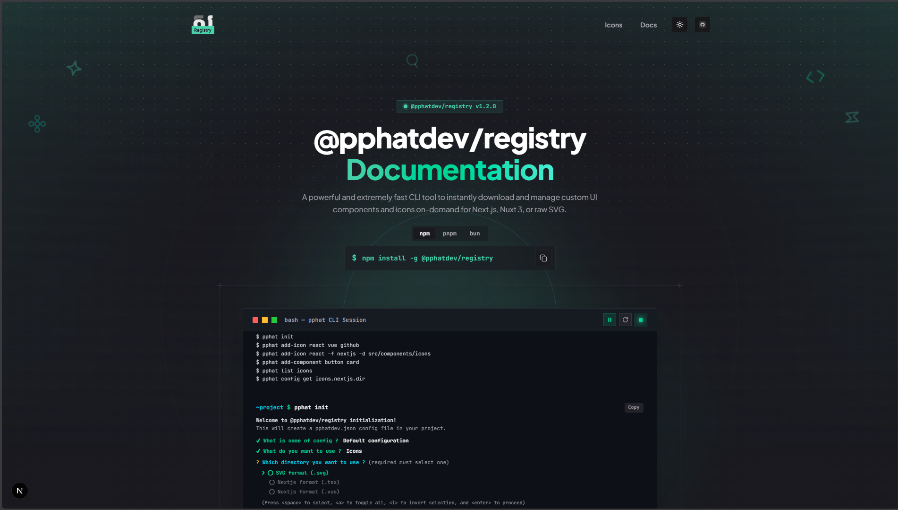

# @pphatdev/registry



[](https://npmjs.org/package/@pphatdev/registry)
[](https://npmjs.org/package/@pphatdev/registry)
[](https://github.com/pphatdev/icons/actions/workflows/ci.yml)

A powerful and extremely fast CLI tool to instantly download and manage custom UI components and icons for your frontend projects.

Instead of bundling thousands of heavy icons in an npm package, this CLI dynamically fetches precisely the components and icons you need on-demand. It supports outputting raw SVGs, or converting them into ready-to-use, perfectly formatted **Next.js** (React) or **Nuxt.js** (Vue) components.

This repository powers the showcase and documentation site for the `@pphatdev/registry` CLI. It is built with Next.js, Tailwind CSS, and Framer Motion.

## Why @pphatdev/registry

- **Zero Bundle Bloat** — Only download the components and icons you actually use in your project.
- **Lightning Fast** — Powered by a static registry hosted on GitHub's raw CDN (no rate limits for users).
- **Framework Native** — Automatically wraps SVGs into `.tsx` (React) or `.vue` (Nuxt) components if desired.
- **Perfect Code Formatting** — Integrated XML formatter that precisely aligns tags, preserving nested CSS (`@keyframes`) and attributes for lint-free output.
- **Configurable & Persistent** — Automatically remembers your preferred directory and format via a tiny configuration file.

## Usage

You don't need to install it. Run it directly using `npx`:

```bash
npx @pphatdev/registry init
# short aliases
npx pphat init
npx pphatdev init
```

### 1. Initialize your project

Run the `init` command to set up your preferences. It will ask you where you want to save your items and what format you prefer (SVG, Next.js, or Nuxt.js). This generates a `pphatdev.json` file in the root of your project:

```json
{
  "use": {
    "nextjs": true,
    "nuxtjs": true,
    "svg": true
  },
  "nextjs": { "dir": "test-icons" },
  "nuxtjs": { "dir": "test-icons" },
  "svg":    { "dir": "test-icons" }
}
```

### 2. Browse the registry

List available items in the registry with pagination:

```bash
npx pphat list icons
npx pphat ls components
```

### 3. Add an item

Download a component or icon (for example, `react`, `vue`, `github`) with the `add` command. It automatically downloads and formats it based on your `pphatdev.json` preferences.

```bash
npx pphat add react
```

Override the output format on the fly with `-f` / `--format`:

```bash
# Raw SVG
npx pphat add react -f svg

# Next.js React component
npx pphat add react -f nextjs

# Nuxt.js Vue component
npx pphat add react -f nuxtjs
```

## Global installation (optional)

If you plan to use it frequently across many projects, install it globally:

```bash
npm install -g @pphatdev/registry
```

Then use the short commands:

```bash
pphat init
pphat add github
pphat list icons
```

> **Getting an EEXIST error?** This happens if an old version's binary is stuck in your npm cache. Run `npm install -g @pphatdev/registry --force` to overwrite it.

## Local development (this docs site)

1. Install dependencies using **pnpm**:

   ```bash
   pnpm install
   ```

2. Run the development server:

   ```bash
   pnpm dev
   ```

3. Open [http://localhost:3000](http://localhost:3000) with your browser to see the result.

## For contributors / registry maintainers

If you are updating the icon registry itself, follow these steps.

### Building the registry

The icons are hosted on a GitHub repository and parsed into a lightweight `registry/index.json`. To rebuild the registry locally:

1. Generate a GitHub Personal Access Token.
2. Run the build script with the token in your environment (to avoid GitHub API rate limits):

   ```bash
   # Linux / macOS
   GITHUB_TOKEN="your_token" npm run build:registry

   # Windows (PowerShell)
   $env:GITHUB_TOKEN="your_token"; npm run build:registry
   ```

> A GitHub Actions workflow runs automatically whenever a new GitHub **Release** is published, keeping the registry up to date.

## Contributing

Pushing or opening a Pull Request to the `main` branch will automatically trigger the CI workflow to lint and build the application.
